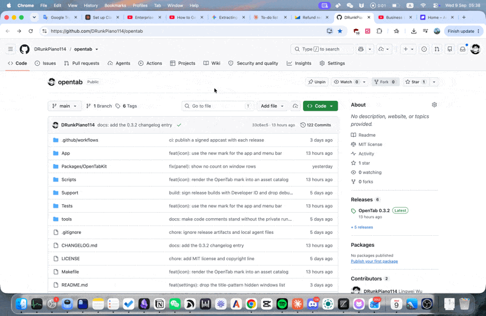

<p align="center"></p>
<h1 align="center">OpenTab</h1>
<p align="center">Open source window and tab switcher for macOS.</p>

<p align="center"></p>

## Requirements

macOS 26 or later, Apple silicon.

## Install

1. Download `OpenTab-<version>.zip` from the [latest release](https://github.com/DRunkPiano114/opentab/releases/latest) and unzip it.
2. Drag `OpenTab.app` into Applications.
3. Open it. It is signed and notarized, so macOS asks once. The first-run guide handles permissions and your shortcut.

## Use

| Keys | Action |
|---|---|
| `⌘ Tab` | Open the list and step forward; release ⌘ to switch |
| `⇧ ⌘ Tab` | Same, stepping backward |
| `⌥ Tab` / `⇧ ⌥ Tab` | The same two actions when OpenTab is set to Option-Tab |
| `Enter` (in the list) or `⇧ ⌘ L` | Search by app, window title, tab title or address |
| `Right Arrow` / `Left Arrow` | Open a window's tabs in a side pane / go back |
| `⌘ W` (while searching) | Close the selected tab |
| `Escape` | Clear the search, leave the side pane, then dismiss |

Search is forgiving: a few characters in the right order match. Chinese titles match by character, by full pinyin or by initials.

**Settings** (from the menu bar icon) has four tabs: General (open at login, menu bar icon, panel position, text size and width, sort order), Shortcuts (the three shortcuts; a shortcut field's × puts its default back), Privacy (private windows, icons, permissions), About (version, updates, a link to this page, memory and uptime).

**Command-Tab** opens OpenTab instead of the system app switcher while OpenTab runs, and the system switcher comes back when OpenTab quits. If OpenTab is force quit and Command-Tab stays dead, the next launch of OpenTab puts it back, or you can put it back right away with:

```bash
/Applications/OpenTab.app/Contents/MacOS/OpenTab --restore-cmd-tab
```

Where the takeover is unavailable, before you grant Accessibility, or while another copy of OpenTab is running, OpenTab uses Option-Tab instead and says so in Settings and in the menu bar.

## Build from source

Xcode 26 and [xcodegen](https://github.com/yonaskolb/XcodeGen) (`brew install xcodegen`).

```bash
make build      # generate the project and build Debug into build/
make test       # OpenTabKit unit tests, no permissions needed
make test-app   # app-hosted tests; needs the Accessibility grant and drives the real UI
make run        # install to ~/Applications as "OpenTab Dev" and launch
```

Debug builds are signed with a self-signed certificate that `make build` creates on first use, so the Accessibility grant survives rebuilds.

The first `make build` after a clean checkout downloads Sparkle through Swift Package Manager, so it needs network once; `make test` never does.

## License

MIT. Copyright (c) 2026 Lingwei Wu.
